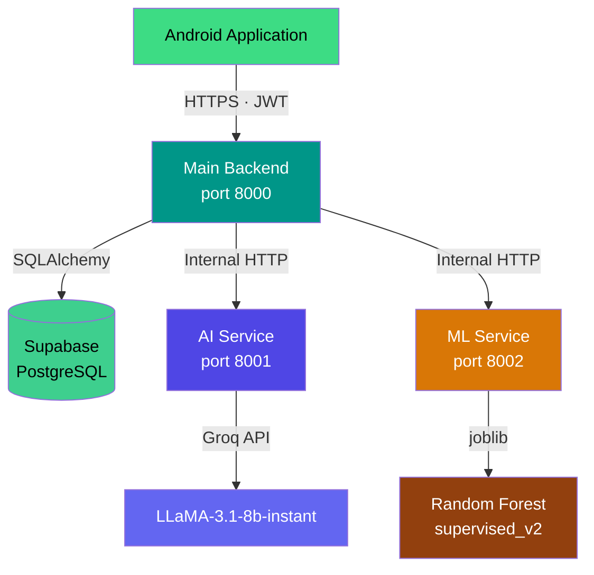

<div align="center">

# Finance Tracker — Backend

**Three independently deployed FastAPI microservices: a main orchestration backend, an AI classification service, and an ML anomaly detection service. All hosted on Render against a Supabase PostgreSQL database.**

<br/>

[](https://python.org)
[](https://fastapi.tiangolo.com)
[](https://supabase.com)
[](https://render.com)

</div>

---

## Table of Contents

- [Service Overview](#service-overview)
- [Architecture](#architecture)
- [Main Backend](#main-backend)
- [API Reference](#api-reference)
- [Database Design](#database-design)
- [Local Development](#local-development)
- [Environment Variables](#environment-variables)
- [Render Deployment](#render-deployment)
- [Supabase Setup](#supabase-setup)
- [Troubleshooting](#troubleshooting)

---

## Service Overview

| Service | Directory | Port | Purpose |
|---|---|---|---|
| Main Backend | `app/` | 8000 | Authentication, transactions, PDF import, service orchestration |
| AI Classification | `ai/` | 8001 | LLM-powered category classification and statement cleanup |
| ML Anomaly Detection | `ml/` | 8002 | Random Forest inference for unusual spending detection |

Each service is an independent FastAPI application. They share no runtime state. The only communication between them is HTTP — initiated by the main backend calling the AI and ML services. Each service has its own `requirements.txt`, its own environment configuration, and its own Render service definition.

---

## Architecture



### Orchestration Pattern

The main backend is the sole public entry point. When a transaction is created:

1. It calls the AI service to classify the transaction's category
2. It persists the transaction to the database
3. It retrieves the user's recent transaction history
4. It calls the ML service to score the transaction for anomalous behaviour
5. It updates the persisted record with the anomaly result
6. It returns the complete response to the Android app

The Android app receives a single response that includes both the AI classification and the ML anomaly result. It makes no direct calls to the AI or ML services.

---

## Main Backend

### Responsibilities

- User registration and login — JWT issuance and verification
- Transaction creation, retrieval, and dashboard aggregation
- PDF bank statement parsing, preview, and user-confirmed import
- Orchestrating AI classification for every new transaction
- Orchestrating ML anomaly detection for every new transaction
- Serving the insights feed (confirmed anomalous transactions)
- Rate limiting on all auth endpoints

### Directory Structure

```
app/
├── app.py              FastAPI app factory, CORS middleware, startup diagnostics
├── config.py           pydantic-settings configuration from .env
├── database.py         SQLAlchemy engine, session factory, health check functions
├── main.py             Entry point alias (uvicorn app.app:app or uvicorn main:app)
│
├── routes/
│   ├── auth.py         POST /auth/signup, POST /auth/login, GET /auth/me
│   ├── transactions.py POST /transactions/manual, GET /transactions,
│   │                   GET /transactions/dashboard, GET /transactions/{id}
│   ├── statements.py   POST /statements/upload, POST /statements/{id}/import
│   └── insights.py     GET /insights
│
├── services/
│   ├── auth_service.py              Signup, login, bcrypt hashing
│   ├── transaction_service.py       Create, list, dashboard aggregation
│   ├── statement_parser_service.py  pdfplumber extraction, multi-strategy fallback
│   ├── statement_cleanup_client.py  HTTP client calling AI /statements/cleanup
│   └── statement_import_service.py  Import approved preview rows with full AI+ML pass
│
├── models/
│   ├── user.py             SQLAlchemy User ORM model
│   ├── transaction.py      SQLAlchemy Transaction ORM model
│   └── statement_upload.py SQLAlchemy StatementUpload ORM model
│
├── schemas/
│   ├── auth.py         SignupRequest, LoginRequest, AuthResponse
│   ├── user.py         UserResponse
│   ├── transaction.py  ManualTransactionRequest, TransactionResponse, DashboardResponse
│   ├── statement.py    StatementUploadResponse, StatementImportRequest, ParsedTransactionPreview
│   └── insight.py      InsightItemResponse, InsightSummaryResponse, InsightsResponse
│
└── core/
    ├── security.py     JWT creation, verification, get_current_user dependency
    └── rate_limit.py   slowapi Limiter instance
```

---

## API Reference

All authenticated endpoints require the header:
```
Authorization: Bearer <access_token>
```

Interactive documentation is available at `http://localhost:8000/docs` when running locally.

---

### Health

```
GET  /            → {"message": "FinSight AI backend is running"}
GET  /health      → {"status": "healthy"}
GET  /health/db   → {"status": "healthy", "database": "connected"}
                    or 503 {"status": "unhealthy", "database": "unreachable"}
```

---

### Authentication

#### POST /auth/signup

Public. Rate limited to **3 requests per minute**.

Request body:

```json
{
  "first_name": "Princy",
  "last_name": "Patel",
  "email": "princy@example.com",
  "password": "SecurePassword123",
  "country": "Canada",
  "default_currency": "CAD"
}
```

Response `201 Created`:

```json
{
  "access_token": "eyJhbGciOiJIUzI1NiIsInR5cCI6IkpXVCJ9...",
  "token_type": "bearer"
}
```

Error responses:

| Status | Condition |
|---|---|
| 409 Conflict | Email address already registered |
| 422 Unprocessable Entity | Validation failure (missing field, invalid format) |
| 429 Too Many Requests | Rate limit exceeded |

---

#### POST /auth/login

Public. Rate limited to **5 requests per minute**.

Request body:

```json
{
  "email": "princy@example.com",
  "password": "SecurePassword123"
}
```

Response `200 OK`:

```json
{
  "access_token": "eyJhbGciOiJIUzI1NiIsInR5cCI6IkpXVCJ9...",
  "token_type": "bearer"
}
```

Error responses:

| Status | Condition |
|---|---|
| 401 Unauthorized | Invalid email or password |
| 429 Too Many Requests | Rate limit exceeded |

---

#### GET /auth/me

Authenticated. Rate limited to **30 requests per minute**.

Response `200 OK`:

```json
{
  "id": "550e8400-e29b-41d4-a716-446655440000",
  "first_name": "Princy",
  "last_name": "Patel",
  "email": "princy@example.com",
  "country": "Canada",
  "default_currency": "CAD"
}
```

---

### Transactions

#### POST /transactions/manual

Authenticated. Creates a manual transaction. Internally calls the AI service for classification and the ML service for anomaly detection before returning.

Request body:

```json
{
  "merchant": "Tim Hortons",
  "amount": 4.75,
  "notes": "Morning coffee",
  "transaction_type": "expense",
  "transaction_date": "2025-06-03T08:30:00Z"
}
```

Response `200 OK`:

```json
{
  "id": 42,
  "merchant": "Tim Hortons",
  "amount": 4.75,
  "notes": "Morning coffee",
  "transaction_type": "expense",
  "category_name": "Food & Drinks",
  "confidence": 0.94,
  "reason": "Tim Hortons is a well-known coffee and fast food chain.",
  "is_anomaly": false,
  "anomaly_status": "normal",
  "anomaly_score": 0.08,
  "anomaly_reason": null,
  "ml_model_version": "supervised_v2",
  "created_at": "2025-06-03T08:30:05Z"
}
```

---

#### GET /transactions

Authenticated. Returns all transactions for the authenticated user, ordered by `created_at` descending.

Response `200 OK`: array of `TransactionResponse` objects.

---

#### GET /transactions/dashboard

Authenticated. Returns aggregated financial summary.

Response `200 OK`:

```json
{
  "balance": 2450.00,
  "total_income": 5000.00,
  "total_expenses": 2550.00,
  "recent_transactions": [
    {
      "id": 42,
      "merchant": "Tim Hortons",
      "amount": 4.75,
      "category_name": "Food & Drinks",
      "is_anomaly": false,
      "created_at": "2025-06-03T08:30:05Z"
    }
  ]
}
```

---

#### GET /transactions/{transaction_id}

Authenticated. Returns a single transaction by ID. Returns `404` if the transaction does not belong to the authenticated user.

---

### Statements (PDF Import)

#### POST /statements/upload

Authenticated. Accepts a PDF bank or credit-card statement, extracts transactions via pdfplumber, optionally runs the AI cleanup pass, and returns a preview for user review.

Request: `multipart/form-data`, field name `file`, content-type `application/pdf`, maximum 10 MB.

Response `201 Created`:

```json
{
  "upload_id": "7c9e6679-7425-40de-944b-e07fc1f90ae7",
  "file_name": "td_statement_may_2025.pdf",
  "status": "parsed",
  "total_transactions": 31,
  "transactions": [
    {
      "transaction_date": "2025-05-15",
      "description": "TIM HORTONS #2234",
      "amount": 4.75,
      "raw_text": "05/15 TIM HORTONS #2234 4.75"
    }
  ],
  "parse_error": null
}
```

---

#### POST /statements/{upload_id}/import

Authenticated. Imports the user-confirmed rows from a previously uploaded statement. Each transaction goes through AI classification and ML anomaly detection.

Request body:

```json
{
  "transactions": [
    {
      "transaction_date": "2025-05-15",
      "description": "TIM HORTONS #2234",
      "amount": 4.75,
      "transaction_type": "expense"
    }
  ]
}
```

Response `201 Created`:

```json
{
  "imported_count": 31,
  "failed_count": 0
}
```

---

### Insights

#### GET /insights

Authenticated. Returns anomalous transactions for the user. Only rows with `anomaly_status = 'confirmed_anomaly'` are included — cold-start and normal results are excluded.

Response `200 OK`:

```json
{
  "summary": {
    "total_insights": 2,
    "unusual_count": 2,
    "tips_count": 0,
    "pattern_count": 0
  },
  "items": [
    {
      "id": 1,
      "type": "unusual",
      "title": "Unusual Electronics transaction",
      "description": "This is one of your higher Electronics transactions, and it happened at an unusual time.",
      "value": "$1,299.99",
      "transaction_id": 87,
      "severity": "high",
      "created_at": "2025-06-01T14:22:00Z"
    }
  ]
}
```

Severity levels:

| Severity | Anomaly Score Range |
|---|---|
| `low` | < 0.50 |
| `medium` | 0.50 – 0.80 |
| `high` | > 0.80 |

---

## Database Design

All tables reside in Supabase. SQL migration files are in `backend/sql/`.

### Table: users

| Column | Type | Constraints |
|---|---|---|
| `id` | UUID | Primary key, `gen_random_uuid()` |
| `first_name` | TEXT | NOT NULL |
| `last_name` | TEXT | NOT NULL |
| `email` | TEXT | UNIQUE, NOT NULL |
| `password_hash` | TEXT | NOT NULL |
| `country` | TEXT | Default: `Canada` |
| `default_currency` | TEXT | Default: `CAD` |
| `created_at` | TIMESTAMPTZ | Default: `now()` |
| `updated_at` | TIMESTAMPTZ | Auto-updated via trigger |

An `update_updated_at` trigger fires `BEFORE UPDATE` on every row to keep `updated_at` current automatically.

### Table: categories

| Column | Type | Constraints |
|---|---|---|
| `id` | SERIAL | Primary key |
| `name` | TEXT | NOT NULL |
| `normalized_name` | TEXT | NOT NULL |
| `transaction_type` | TEXT | CHECK: `income` or `expense` |
| `created_at` | TIMESTAMPTZ | Default: `now()` |

Unique constraint on `(normalized_name, transaction_type)`. Indexed on `(normalized_name, transaction_type)`.

### Table: transactions

| Column | Type | Notes |
|---|---|---|
| `id` | SERIAL | Primary key |
| `user_id` | UUID | FK → users.id, ON DELETE CASCADE |
| `merchant` | TEXT | |
| `amount` | FLOAT | |
| `notes` | TEXT | Default: `''` |
| `transaction_type` | TEXT | CHECK: `income` or `expense` |
| `category_id` | INTEGER | FK → categories.id |
| `category_name` | TEXT | Denormalized for query speed |
| `confidence` | FLOAT | AI classification confidence |
| `reason` | TEXT | AI classification reason |
| `created_at` | TIMESTAMPTZ | |
| `is_anomaly` | BOOLEAN | ML detection result |
| `anomaly_score` | FLOAT | Random Forest probability (class 1) |
| `anomaly_reason` | TEXT | Human-readable anomaly explanation |
| `anomaly_checked_at` | TIMESTAMPTZ | Timestamp of ML evaluation |
| `ml_model_version` | TEXT | e.g. `supervised_v2` |

Indexes: `(user_id)`, `(user_id, created_at DESC)`, `(user_id, is_anomaly)`, `(anomaly_checked_at)`.

### Table: statement_uploads

| Column | Type | Notes |
|---|---|---|
| `id` | UUID | Primary key |
| `user_id` | UUID | FK → users.id |
| `file_name` | TEXT | Original PDF filename |
| `status` | TEXT | `uploaded`, `parsed`, or `parse_failed` |
| `total_transactions` | INTEGER | Parsed row count |
| `created_at` | TIMESTAMPTZ | |

---

## Local Development

### Prerequisites

- Python 3.11 or 3.12
- A Supabase project (free tier)
- A Groq API key (free at [console.groq.com](https://console.groq.com))

### Setup

```bash
cd backend

# Create virtual environment
python -m venv venv
source venv/bin/activate      # Windows: venv\Scripts\activate

# Install all dependencies
pip install -r requirements.txt

# Configure environment
cp .env.example .env
# Edit .env — set DATABASE_URL and JWT_SECRET_KEY at minimum
```

### Running Services Locally

Open three terminals, each from the `backend/` directory with the virtual environment activated:

```bash
# Terminal 1 — Main Backend
uvicorn app.app:app --reload --port 8000

# Terminal 2 — AI Classification Service
uvicorn ai.app:app --reload --port 8001

# Terminal 3 — ML Anomaly Detection Service
python -m ml.download_models   # one-time, downloads ~605 MB
uvicorn ml.app:app --reload --port 8002
```

### Verifying Health

```bash
curl http://localhost:8000/health
# {"status":"healthy"}

curl http://localhost:8000/health/db
# {"status":"healthy","database":"connected"}

curl http://localhost:8001/health
# {"status":"ok","service":"finsight-ai-service","model":"llama-3.1-8b-instant"}

curl http://localhost:8002/health
# {"status":"healthy","model_ready":true}
```

### Generating a Secure JWT Secret

```bash
python -c "import secrets; print(secrets.token_hex(32))"
```

---

## Environment Variables

### Main Backend (`backend/.env`)

```dotenv
# --- Required ---
DATABASE_URL=postgresql://postgres:<password>@db.<project>.supabase.co:5432/postgres
JWT_SECRET_KEY=<64-character-random-hex>

# --- Optional ---
JWT_ALGORITHM=HS256
ACCESS_TOKEN_EXPIRE_MINUTES=60
APP_ENV=development
AI_BACKEND_URL=https://financial-app-tracker-ai-service.onrender.com
ML_SERVICE_URL=https://financial-app-tracker-ml-service.onrender.com
AI_CLEANUP_ENABLED=false
AI_CLEANUP_TIMEOUT_SECONDS=15
```

| Variable | Required | Default | Description |
|---|---|---|---|
| `DATABASE_URL` | Yes | — | Supabase PostgreSQL connection URI |
| `JWT_SECRET_KEY` | Yes | — | HMAC signing secret for JWT |
| `JWT_ALGORITHM` | No | `HS256` | JWT signing algorithm |
| `ACCESS_TOKEN_EXPIRE_MINUTES` | No | `60` | Token lifetime |
| `APP_ENV` | No | `development` | Environment label |
| `AI_BACKEND_URL` | No | Render URL | Internal URL of the AI service |
| `ML_SERVICE_URL` | No | Render URL | Internal URL of the ML service |
| `AI_CLEANUP_ENABLED` | No | `false` | Run AI cleanup on PDF transactions |
| `AI_CLEANUP_TIMEOUT_SECONDS` | No | `15` | Timeout for AI cleanup HTTP call |

---

## Render Deployment

### Main Backend

| Setting | Value |
|---|---|
| Root Directory | `backend` |
| Build Command | `pip install -r requirements.txt` |
| Start Command | `uvicorn app.app:app --host 0.0.0.0 --port $PORT` |

### AI Classification Service

| Setting | Value |
|---|---|
| Root Directory | `backend` |
| Build Command | `pip install -r ai/requirements.txt` |
| Start Command | `uvicorn ai.app:app --host 0.0.0.0 --port $PORT` |

### ML Anomaly Detection Service

| Setting | Value |
|---|---|
| Root Directory | `backend` |
| Build Command | `pip install -r ml/requirements.txt` |
| Start Command | `python -m ml.download_models && uvicorn ml.app:app --host 0.0.0.0 --port $PORT` |

Add all variables from `backend/.env.example` to the **Environment** tab of each Render service before deploying.

---

## Supabase Setup

1. Create a free project at [supabase.com](https://supabase.com)
2. Go to **Settings > Database > Connection string > URI**
3. Copy the connection string and set it as `DATABASE_URL`
4. Open the **SQL Editor** in the Supabase dashboard
5. Run each migration file in order:

```sql
-- 1. Users table and auto-update trigger
-- Contents of: backend/sql/create_tables.sql

-- 2. Categories and transactions tables
-- Contents of: backend/sql/create_transaction_tables.sql

-- 3. Statement uploads table
-- Contents of: backend/sql/add_statement_uploads.sql
```

---

## Troubleshooting

### 404 on all routes

- Confirm **Root Directory** is set to `backend` in the Render service configuration, not the repository root
- Verify the service shows **Live** status in the Render dashboard
- Check Render logs for Python import errors during startup

### 502 Bad Gateway

- Render free-tier services cold-start — the first request after an idle period may take 20–30 seconds
- Check Render deploy logs for startup exceptions
- If the database connection fails at startup, the service will start but `/health/db` will return 503

### Database connection errors at startup

- Verify `DATABASE_URL` is correctly set in the Render environment settings
- Confirm the Supabase project is active — free projects pause after 7 days of inactivity
- Test connectivity locally: `psql "$DATABASE_URL" -c "SELECT 1"`

### 401 Unauthorized on all authenticated endpoints

- Confirm `JWT_SECRET_KEY` has not changed between deploys — changing it invalidates all existing tokens
- Confirm the Android app is sending `Authorization: Bearer <token>` in the header
- Tokens expire after `ACCESS_TOKEN_EXPIRE_MINUTES` — re-authenticate to get a fresh token

### AI service not classifying transactions

- Confirm `AI_BACKEND_URL` points to the live AI service on Render
- Check the AI service Render logs for Groq API errors
- Confirm `GROQ_API_KEY` is set in the AI service environment
- If the AI service is unreachable, a fallback classification (`Other`, confidence 0.3) is returned — check the transaction's confidence field

### ML service not evaluating anomalies

- Confirm `ML_SERVICE_URL` is set and the ML service is running on Render
- Check ML service startup logs for `model_ready: true`
- If `download_models.py` failed, the service has no model files and will fail to classify
- Confirm at least 10 expense transactions exist for the user (cold-start protection)

### Statement upload returns `parse_failed`

- Only `application/pdf` MIME type is accepted
- The PDF must be text-based — pdfplumber cannot extract text from scanned image PDFs
- File size must be under 10 MB
- Check backend logs for the `parse_strategy` and `candidates count` log lines
