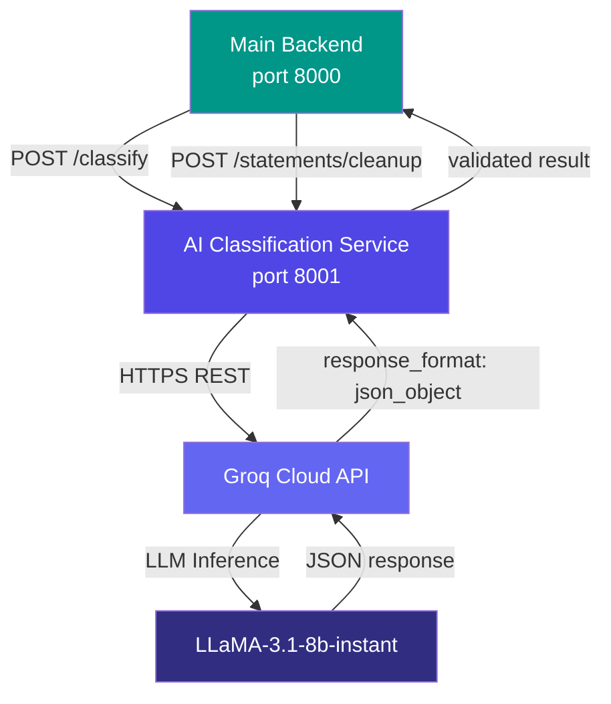

<div align="center">

# Finance Tracker — AI Classification Service

**An internal FastAPI microservice that classifies financial transactions into spending categories using LLaMA-3.1-8b-instant via the Groq Cloud API. Stateless, fast-starting, and independently deployable.**

<br/>

[](https://python.org)
[](https://fastapi.tiangolo.com)
[](https://groq.com)
[](https://groq.com)
[](https://render.com)

</div>

---

## Table of Contents

- [Purpose](#purpose)
- [Architecture](#architecture)
- [Service Overview](#service-overview)
- [Classification Workflow](#classification-workflow)
- [Prompt Engineering](#prompt-engineering)
- [Confidence Scoring](#confidence-scoring)
- [Fallback Behaviour](#fallback-behaviour)
- [API Contract](#api-contract)
- [Service Structure](#service-structure)
- [Environment Variables](#environment-variables)
- [Local Development](#local-development)
- [Render Deployment](#render-deployment)
- [Error Handling](#error-handling)
- [Troubleshooting](#troubleshooting)

---

## Purpose

Every transaction in Finance Tracker requires a spending category. Rather than relying on a static merchant-to-category lookup table — which becomes stale, fails on new merchants, and cannot infer context from notes — this service uses a large language model to classify transactions dynamically.

The AI service has two responsibilities:

1. **Transaction classification** — given a merchant name, amount, and optional notes, determine the transaction type (`income` or `expense`) and assign a category from a preferred taxonomy with a confidence score and reason
2. **Statement cleanup** — given a list of raw PDF-parsed transaction candidates, apply an LLM normalisation pass to fix sign conventions, clean descriptions, and remove unparseable rows

This service is **internal**. The Android application has no knowledge of its URL. All calls originate from the main backend.

---

## Architecture



### CORS Isolation

The service's CORS policy permits requests only from `http://localhost:8000` and `http://127.0.0.1:8000` (the main backend). Any direct call from a browser, Android device, or external tool will be rejected with a CORS error. This is intentional — the service is an internal implementation detail, not a public API.

---

## Service Overview

| Property | Value |
|---|---|
| Port | 8001 |
| Framework | FastAPI (Python 3.12) |
| LLM Provider | Groq Cloud |
| Model | `llama-3.1-8b-instant` |
| Response Format | Structured JSON (enforced via `response_format: json_object`) |
| State | Stateless — no model files, no warm-up |
| Cold-start time | Under 5 seconds |
| Fallback | Returns `Other` category with confidence `0.3` on any error |

---

## Classification Workflow

```
Main Backend receives a transaction (manual entry or PDF import)
        │
        ▼
POST /classify  { merchant, amount, notes }
        │
        ▼
build_prompt()
  loads classify_prompt.txt from disk
  substitutes merchant, amount, notes into template
        │
        ▼
Groq client:
  model = llama-3.1-8b-instant
  messages = [
    { role: system, content: "You are a financial transaction classifier..." },
    { role: user,   content: <filled prompt> }
  ]
  response_format = { type: json_object }
        │
        ▼
LLM returns raw JSON:
  { transaction_type, category_name, confidence, reason }
        │
        ▼
Validation layer:
  - transaction_type: must be "income" or "expense" → default "expense"
  - category_name: stripped, clipped to 3 words, "&" → "and"
  - confidence: cast to float, clamped to [0.0, 1.0]
  - reason: stripped string or default message
        │
        ▼
normalize_category(category_name)
  → lowercase key for database category deduplication
        │
        ▼
ClassifyResponse returned to Main Backend:
  { transaction_type, category_name, normalized_category, confidence, reason }
```

---

## Prompt Engineering

The classification prompt is stored in `prompts/classify_prompt.txt`. Externalising it from the service code means it can be iterated on without code changes or redeployment.

### Design Decisions

| Decision | Rationale |
|---|---|
| Provide a preferred category taxonomy | Constrains the output to a known set of labels, reducing hallucinated or inconsistent category names |
| Separate income and expense category lists | The model learns the correct transaction type mapping from the taxonomy structure itself |
| Instruct the model never to use a merchant name as a category | Without this, the model occasionally returns `{"category_name": "Tim Hortons"}` |
| Notes as a primary signal, amount as secondary | Notes are high-signal (`"paycheck"`, `"rent"`) and should override merchant name inference when present |
| `response_format: json_object` | Eliminates prose responses, markdown wrappers, and partial JSON that would fail parsing |

### Prompt Template

```
Classify this financial transaction.

Use both merchant and notes as primary signals. Use amount as a secondary signal.
If transaction_type is unclear, default to "expense".

Preferred expense categories:
Food & Drinks, Groceries, Transport, Shopping, Bills, Entertainment,
Health, Education, Rent, Insurance, Subscriptions, Pet Care, Fitness, Other

Preferred income categories:
Salary, Benefits, Transfer In, Refund, Interest Income, Rewards,
Investment Income, Other Income

Use a preferred category when it fits.
Never use a merchant or brand name as the category.

Merchant: {merchant}
Amount: {amount}
Notes: {notes}

Return ONLY valid JSON:
{
  "transaction_type": "income or expense",
  "category_name": "",
  "confidence": 0.0,
  "reason": ""
}
```

---

## Confidence Scoring

The LLM is instructed to return a `confidence` value between `0.0` and `1.0` representing its certainty in the classification.

| Confidence Range | Interpretation |
|---|---|
| 0.85 – 1.0 | High confidence — merchant name or notes unambiguously match a category |
| 0.6 – 0.84 | Moderate confidence — reasonable inference but some ambiguity |
| 0.3 – 0.59 | Low confidence — limited signals; category may be incorrect |
| 0.3 (exact) | Fallback value — AI call failed; `Other` returned |

The validation layer clamps the returned value to `[0.0, 1.0]` and rounds to two decimal places. The main backend stores this value in the `transactions.confidence` column.

---

## Fallback Behaviour

If the Groq API returns an error, rate-limits the request, or the response cannot be parsed as valid JSON, the service catches the exception and returns a safe default:

```json
{
  "transaction_type": "expense",
  "category_name": "Other",
  "normalized_category": "other",
  "confidence": 0.3,
  "reason": "Fallback due to invalid AI response."
}
```

This guarantees:
- The main backend always receives a structurally valid `ClassifyResponse`
- Transactions are never blocked from being created due to an AI service failure
- The low confidence score (`0.3`) signals to downstream logic that this classification is uncertain
- Users see `Other` as the category, which they can recategorise manually

---

## API Contract

### POST /classify

Classify a single transaction.

**Request schema:**

```json
{
  "merchant": "string (required)",
  "amount":   "float (required)",
  "notes":    "string (optional, null if absent)"
}
```

**Example request:**

```bash
curl -X POST http://localhost:8001/classify \
  -H "Content-Type: application/json" \
  -d '{"merchant": "Costco", "amount": 187.43, "notes": "weekly groceries"}'
```

**Example response `200 OK`:**

```json
{
  "transaction_type": "expense",
  "category_name": "Groceries",
  "normalized_category": "groceries",
  "confidence": 0.95,
  "reason": "Costco is a wholesale grocery and general merchandise retailer."
}
```

**Response schema:**

| Field | Type | Description |
|---|---|---|
| `transaction_type` | string | `income` or `expense` |
| `category_name` | string | Human-readable category label (max 3 words) |
| `normalized_category` | string | Lowercase key for database deduplication |
| `confidence` | float | Model confidence, 0.0–1.0 |
| `reason` | string | One-sentence classification rationale |

---

### POST /statements/cleanup

Normalise a batch of raw PDF-parsed transaction candidates. Called by the main backend only when `AI_CLEANUP_ENABLED=true`.

**Example request:**

```json
{
  "transactions": [
    {
      "transaction_date": "2025-05-15",
      "description": "TIM HORTONS #2234",
      "amount": -4.75,
      "raw_text": "05/15 TIM HORTONS #2234 4.75 CR"
    }
  ],
  "statement_type": "credit_card"
}
```

**Example response `200 OK`:**

```json
{
  "transactions": [
    {
      "transaction_date": "2025-05-15",
      "description": "Tim Hortons #2234",
      "amount": 4.75,
      "raw_text": "05/15 TIM HORTONS #2234 4.75 CR"
    }
  ]
}
```

The cleanup pass corrects sign conventions (credits vs. debits), normalises casing, and removes rows the LLM determines are not valid transactions (e.g., balance-forward lines, header rows).

---

### GET /health

Liveness probe. Does not verify Groq API connectivity — it only confirms the service process is running.

**Example response `200 OK`:**

```json
{
  "status": "ok",
  "service": "finsight-ai-service",
  "env": "production",
  "model": "llama-3.1-8b-instant"
}
```

---

## Service Structure

```
ai/
├── app.py                  FastAPI factory, CORS, startup logging, exception handler
│
├── api/
│   └── routes.py           POST /classify, POST /statements/cleanup, GET /health
│
├── core/
│   └── config.py           pydantic-settings: GROQ_API_KEY, GROQ_MODEL, AI_ENV
│
├── services/
│   ├── api_service.py              classify_transaction() — Groq call + validation
│   ├── statement_cleanup_service.py clean_statement_transactions() — LLM cleanup pass
│   ├── category_normalizer.py      normalize_category() — lowercase deduplication key
│   └── prompt_loader.py            Loads prompt templates from prompts/
│
├── schemas/
│   ├── classification_schema.py    ClassifyRequest, ClassifyResponse
│   └── statement_cleanup_schema.py StatementCleanupRequest, StatementCleanupResponse
│
└── prompts/
    ├── classify_prompt.txt         Transaction classification prompt template
    └── statement_cleanup_prompt.txt Statement normalisation prompt template
```

---

## Environment Variables

```dotenv
# Required
GROQ_API_KEY=gsk_...

# Optional
GROQ_MODEL=llama-3.1-8b-instant
AI_SERVICE_NAME=finsight-ai-service
AI_ENV=development
```

| Variable | Required | Default | Description |
|---|---|---|---|
| `GROQ_API_KEY` | Yes | — | API key from console.groq.com |
| `GROQ_MODEL` | No | `llama-3.1-8b-instant` | Any Groq-hosted model ID |
| `AI_SERVICE_NAME` | No | `finsight-ai-service` | Service name label for health endpoint |
| `AI_ENV` | No | `development` | Environment label returned by /health |

The service starts without `GROQ_API_KEY` but every classification call returns the fallback response. The startup log emits: `GROQ_API_KEY is missing — all AI calls will fail`.

### Getting a Groq API Key

1. Create a free account at [console.groq.com](https://console.groq.com)
2. Go to **API Keys > Create API Key**
3. Copy the key and set it as `GROQ_API_KEY` in your `.env` file

The Groq free tier provides sufficient throughput for development and moderate production usage.

---

## Local Development

```bash
# From backend/
uvicorn ai.app:app --reload --port 8001

# Or from backend/ai/
uvicorn app:app --reload --port 8001
```

Both forms work. `sys.path` is configured in `app.py` to support both import contexts.

### Setup from scratch

```bash
cd backend/ai
python -m venv venv
source venv/bin/activate      # Windows: venv\Scripts\activate
pip install -r requirements.txt
cp .env.example .env
# Set GROQ_API_KEY in .env
uvicorn app:app --reload --port 8001
```

### Manual test

```bash
curl -X POST http://localhost:8001/classify \
  -H "Content-Type: application/json" \
  -d '{"merchant": "Netflix", "amount": 17.99, "notes": "monthly subscription"}'
```

Expected response:

```json
{
  "transaction_type": "expense",
  "category_name": "Subscriptions",
  "normalized_category": "subscriptions",
  "confidence": 0.97,
  "reason": "Netflix is a streaming subscription service."
}
```

---

## Render Deployment

| Setting | Value |
|---|---|
| Root Directory | `backend` |
| Build Command | `pip install -r ai/requirements.txt` |
| Start Command | `uvicorn ai.app:app --host 0.0.0.0 --port $PORT` |

Add `GROQ_API_KEY` and any optional variables in the Render service **Environment** tab before deploying.

The service is stateless and contains no large assets to download. It cold-starts in under 5 seconds, making it suitable for Render's free tier without meaningful latency impact.

---

## Error Handling

| Error Scenario | Behaviour |
|---|---|
| Groq API key missing | Service starts; every request returns fallback (`Other`, 0.3) |
| Groq API rate limit hit | Exception caught; fallback returned; error logged |
| Groq API network timeout | Exception caught; fallback returned; error logged |
| LLM returns invalid JSON | `json.loads` fails; exception caught; fallback returned |
| LLM returns unknown transaction type | Validation forces to `expense` |
| LLM returns category > 3 words | Clipped to first 3 words |
| LLM returns confidence outside [0, 1] | Clamped to range |
| Unhandled exception in any endpoint | Global exception handler returns `500` with error type |

---

## Troubleshooting

### All classifications return `Other` with confidence `0.3`

This is the fallback response — the Groq API call is failing. Diagnose by:

1. Checking the Render logs for `[classify_transaction] error:` lines
2. Verifying `GROQ_API_KEY` is set and valid in the Render environment tab
3. Testing the key directly:

```bash
curl -X POST https://api.groq.com/openai/v1/chat/completions \
  -H "Authorization: Bearer $GROQ_API_KEY" \
  -H "Content-Type: application/json" \
  -d '{"model":"llama-3.1-8b-instant","messages":[{"role":"user","content":"hi"}]}'
```

### Classification returns unexpected or inconsistent categories

The LLM occasionally generates category names outside the preferred taxonomy, particularly for ambiguous merchants. Options:

- Add specific examples to `classify_prompt.txt` for the failing merchants
- Add a post-processing normalisation step in `api_service.py` for known problem cases
- Switch to a larger model via `GROQ_MODEL` for improved instruction-following

### CORS error when calling the service directly

This is expected. The service only accepts requests from the main backend. For direct testing during development, use `curl` rather than a browser or Postman (which sends a preflight OPTIONS request that CORS will reject).

### Service shows `Unhealthy` on Render

Check the startup logs for:
- Python import errors (missing dependency — rebuild the service)
- `GROQ_API_KEY is missing` (set the key in Render environment settings)

Note that the `/health` endpoint returns `ok` even if `GROQ_API_KEY` is missing — the health check only validates that the process is running. Check startup logs for the key-validation message.
