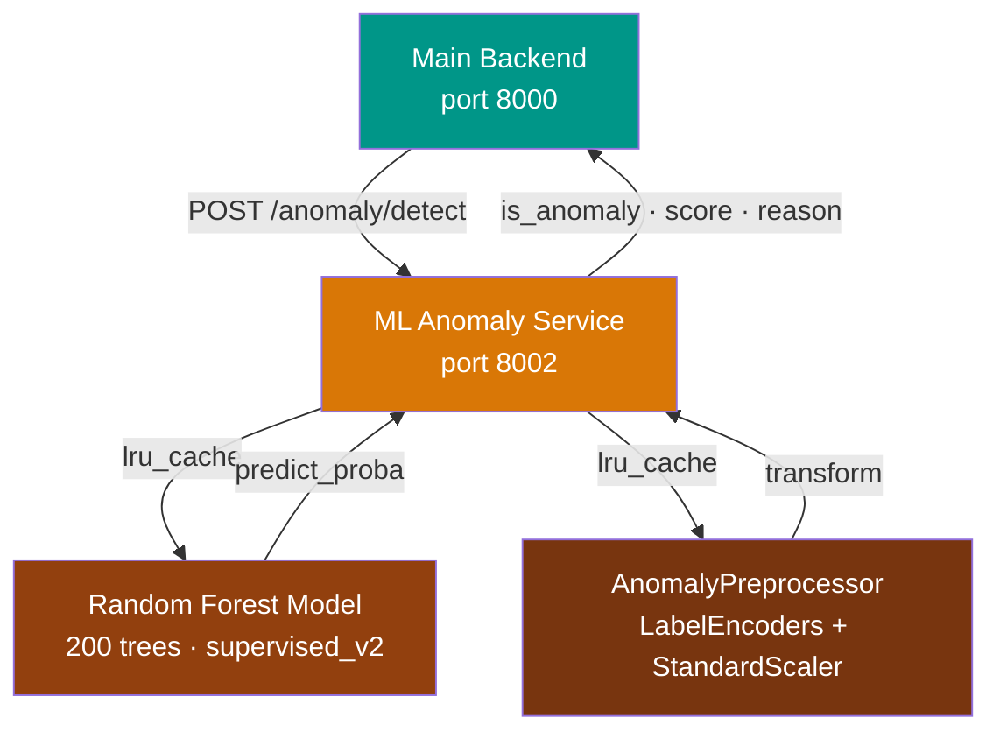
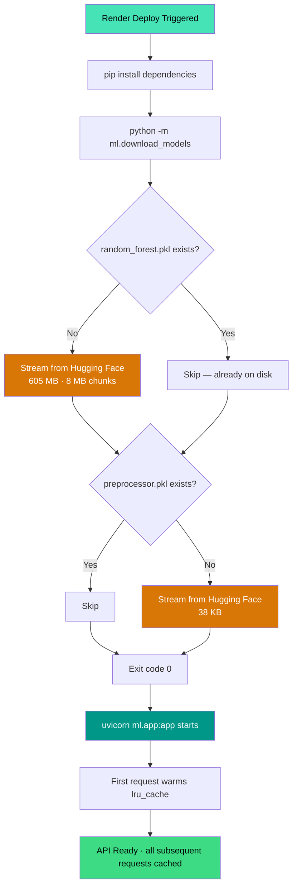
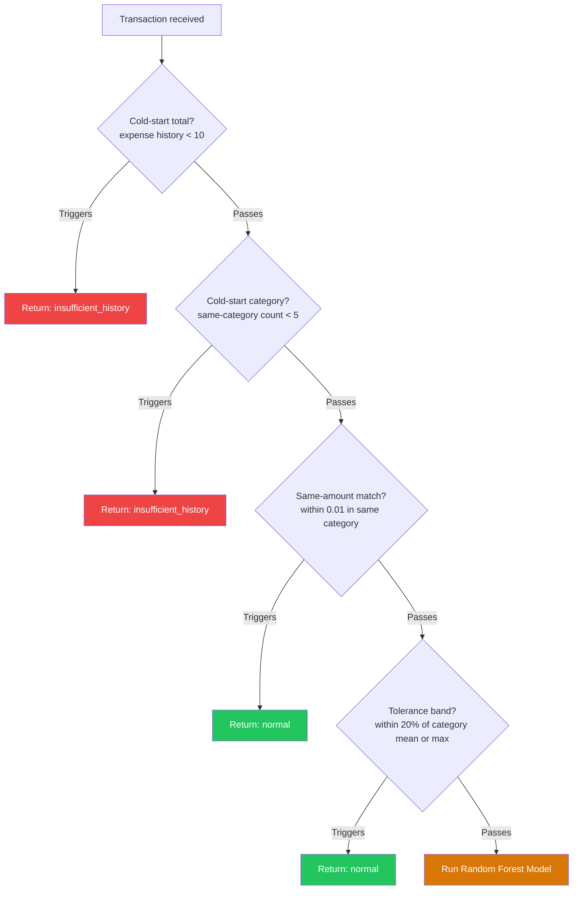

<div align="center">

# Finance Tracker — ML Anomaly Detection Service

**An internal FastAPI microservice that detects unusual spending behaviour using a custom-trained Random Forest classifier. Model artifacts are stored on Hugging Face and bootstrapped at Render startup via a dedicated download script.**

<br/>

[](https://python.org)
[](https://fastapi.tiangolo.com)
[](https://scikit-learn.org)
[](https://huggingface.co)
[](https://render.com)

</div>

---

## Table of Contents

- [Purpose](#purpose)
- [Architecture](#architecture)
- [Model Overview](#model-overview)
- [Feature Engineering](#feature-engineering)
- [Training Pipeline](#training-pipeline)
- [Inference Pipeline](#inference-pipeline)
- [Safeguard System](#safeguard-system)
- [Model Artifacts and Storage](#model-artifacts-and-storage)
- [download_models.py](#download_modelspy)
- [Render Startup Workflow](#render-startup-workflow)
- [API Contract](#api-contract)
- [Service Structure](#service-structure)
- [Environment Variables](#environment-variables)
- [Local Development](#local-development)
- [Render Deployment](#render-deployment)
- [Retraining Process](#retraining-process)
- [Versioning Strategy](#versioning-strategy)
- [Memory Considerations](#memory-considerations)
- [Troubleshooting](#troubleshooting)

---

## Purpose

Finance Tracker's anomaly detection service scores every new transaction against a user's personal spending history and flags statistically unusual behaviour. A purchase that is normal for one user — a $1,200 electronics transaction for a frequent tech buyer — may be highly anomalous for another user who has never made an electronics purchase above $80.

The service uses a Random Forest classifier trained on multi-user synthetic financial data. It operates on thirteen engineered features that capture both raw transaction attributes and behavioural context: z-scores relative to the user's own category history, spending frequency over rolling windows, and temporal signals such as transaction hour and day.

This service is **internal**. The Android application does not call it directly. All requests originate from the main backend, which provides both the transaction under evaluation and the user's recent transaction history in a single request.

---

## Architecture

### Service Communication



### Render Startup Workflow



---

## Model Overview

### Algorithm: RandomForestClassifier

| Hyperparameter | Value | Rationale |
|---|---|---|
| `n_estimators` | 200 | Stable probability estimates via majority vote across 200 trees |
| `max_depth` | None | Unlimited depth allows learning complex, user-specific spending patterns |
| `min_samples_split` | 5 | Prevents splits on small, noisy groups |
| `min_samples_leaf` | 2 | Each leaf requires 2+ samples to reduce overfitting |
| `class_weight` | `balanced` | Auto-upweights the anomaly class to compensate for ~10% base rate |
| `random_state` | 42 | Reproducibility |
| `n_jobs` | -1 | Uses all available CPU cores during training |

### Why Random Forest for Anomaly Detection

- Handles mixed feature types (numeric amounts alongside encoded categorical variables) without preprocessing assumptions
- `class_weight='balanced'` addresses class imbalance without manual oversampling or undersampling
- `predict_proba()` returns calibrated probabilities, enabling threshold tuning without additional calibration
- Feature importances reveal which signals are driving each detection decision — useful for debugging and prompt generation
- Robust to outliers in feature values — important because anomalous transaction amounts are extreme by definition

### Decision Threshold

The default scikit-learn decision boundary is 0.5. This service uses **0.3**.

Lowering the threshold increases recall (more real anomalies caught) at the cost of some precision (more false positives). In a personal finance context, missing a genuine anomaly is a worse outcome than occasionally flagging a normal transaction — the 0.3 threshold reflects this asymmetric cost.

### Primary Training Metric

The model is evaluated on **F2-Score** (F-beta with β=2), which weights recall twice as heavily as precision. Accuracy is tracked but explicitly flagged in training output as misleading on an imbalanced dataset — a model that labels every transaction as normal would achieve ~90% accuracy while catching zero anomalies.

### Model Version

Current production model: `supervised_v2`

The version string is stored inside the joblib artifact under the key `model_version` and returned in every `/anomaly/detect` response as `ml_model_version`. It is also written to the `ml_model_version` column in the transactions table for audit and reproducibility.

---

## Feature Engineering

Thirteen features are engineered from the raw transaction data and user history before being passed to the model. All feature logic lives in `preprocessing/feature_engineering.py`.

### Temporal Features

| Feature | Description | Signal |
|---|---|---|
| `day_of_week` | 0 = Monday, 6 = Sunday | Weekday vs. weekend spending patterns |
| `day_of_month` | 1–31 | Recurring payments: rent on the 1st, salary biweekly |
| `month` | 1–12 | Seasonal spending patterns |
| `hour` | 0–23 | Late-night transactions (1–4 AM) are anomalous for most users |
| `is_weekend` | 0 or 1 | Binary weekday/weekend distinction |

### Amount Features

| Feature | Formula | Signal |
|---|---|---|
| `log_amount` | `log1p(amount)` | Compresses the wide dollar range onto a linear scale |
| `amount_zscore` | `(amount - group_mean) / group_std` | Standard deviations from the user's average in this category |
| `category_percentile` | `rank(pct=True)` within user × category | Rank relative to the user's own same-category history |

**amount_zscore example:** A user's average Food & Drinks transaction is $18 (std = $7). A $200 food charge has a z-score of `(200 − 18) / 7 = 26.0` — a strong anomaly signal regardless of whether the absolute amount is large.

**category_percentile example:** If 50 prior food transactions all fall between $4 and $25, a $200 food charge receives a percentile of 1.0. This signal is complementary to z-score — it captures outlier rank even when the category standard deviation is large.

### Behavioural Feature

| Feature | Description | Signal |
|---|---|---|
| `spending_freq_7d` | Count of same-category transactions in the 7-day window ending on the transaction's date | Card-compromise-style burst frequency anomalies |

This feature is computed with `np.searchsorted` (O(n log n) per group) rather than a boolean-mask scan (O(n²)) to remain performant on large history datasets.

### Categorical Features (Encoded)

| Feature | Encoding |
|---|---|
| `user_id_enc` | LabelEncoder, fitted on training users |
| `merchant_enc` | LabelEncoder |
| `category_enc` | LabelEncoder |
| `transaction_type_enc` | LabelEncoder |

The fitted encoders are persisted in `preprocessor.pkl` and reused at inference time to ensure identical integer mappings.

### Feature Computation at Inference

The caller provides both the new transaction and the user's recent history. Both are combined into a single DataFrame, features are engineered over the full context, and only the last row (the new transaction, which is last after chronological sort) is extracted for scoring. This means `amount_zscore` and `category_percentile` reflect the user's actual spending history rather than population averages.

---

## Training Pipeline

Located in `training/train.py`. Run from `backend/ml/`:

```bash
python -m training.train
```

The pipeline runs eight sequential steps with structured console output for each.

### Step 1 — Load Dataset

Loads `data/transactions_multiuser.csv`. If the CSV does not exist, the dataset generator runs automatically (approximately 5 minutes). The synthetic dataset represents multiple users with realistic spending distributions and a ~10% labelled anomaly rate.

### Step 2 — Feature Engineering

Applies all five transformations in sequence:
`extract_date_features` → `compute_log_amount` → `compute_amount_zscore` → `compute_category_percentile` → `compute_spending_frequency`

### Step 3 — Stratified Train-Test Split

80 / 20 split with `stratify=y`. Stratification ensures both the training and test sets have the same anomaly percentage — without it, a random split on an imbalanced dataset may produce a test set with very few anomaly examples.

### Step 4 — Preprocessing (fitted on training data only)

`AnomalyPreprocessor.fit_transform(X_train_raw)` fits four `LabelEncoder` instances and one `StandardScaler` on the training split exclusively. The test split is then transformed using the already-fitted encoders and scaler. This prevents data leakage from the test set into the fitting process.

### Step 5 — Train RandomForestClassifier

Fits the model on the preprocessed training features using the parameters defined in `models/random_forest.py`.

### Step 6 — Predict with Custom Threshold

`predict_proba()` returns anomaly probabilities. The 0.3 threshold is applied: `(y_probs >= 0.3).astype(int)`. This step is kept separate from Step 5 to enable threshold adjustments without retraining.

### Step 7 — Evaluate

Reports accuracy, precision, recall, F1, and F2 with a full confusion matrix and per-class breakdown. The output explicitly interprets TP, FP, FN, and TN in the context of fraud detection.

### Step 8 — Save Artifacts

Writes two files to `saved_models/`:

| File | Approximate Size | Contents |
|---|---|---|
| `random_forest.pkl` | ~605 MB | joblib artifact: fitted model, model_name, model_version, trained_on, feature_columns, rf_params, threshold, metrics |
| `preprocessor.pkl` | ~38 KB | Serialised `AnomalyPreprocessor` with fitted LabelEncoders and StandardScaler |

---

## Inference Pipeline

The full inference logic lives in `services/prediction_service.py`.

```
POST /anomaly/detect  { transaction, history }
          │
          ▼
_apply_safeguards(transaction, history)
  Rule-based pre-checks; returns early result if any trigger
          │  (all safeguards pass)
          ▼
_load_model()         ← lru_cache(maxsize=1), disk load only on first call
_load_preprocessor()  ← lru_cache(maxsize=1), disk load only on first call
          │
          ▼
_build_context_df(transaction, history)
  Concatenate history + new transaction
  Parse transaction_date as ISO8601
  Sort by date ascending (new transaction is last row)
          │
          ▼
engineer_features(df)
  All 5 transformations applied
          │
          ▼
target_row = df.iloc[-1]
target_df  = pd.DataFrame([target_row])
          │
          ▼
AnomalyPreprocessor.transform(target_df)
  LabelEncode categorical columns
  StandardScale all 13 features → numpy array X
          │
          ▼
model.predict_proba(X)[0][1]  →  anomaly probability
(probability >= 0.3)           →  is_anomaly (bool)
          │
          ▼
_build_reason(row, is_anomaly, confidence)
  Checks: high_amount  (zscore > 2.0 or percentile > 0.95)
          high_freq    (spending_freq_7d > 5)
          unusual_time (1 <= hour <= 4)
  Returns a natural-language sentence for anomalies, None for normal
          │
          ▼
PredictionResponse:
  { transaction_id, user_id, is_anomaly, anomaly_status, confidence, reason, model_version }
```

### Model Loading Strategy

`_load_model()` and `_load_preprocessor()` are decorated with `@lru_cache(maxsize=1)`. The first call to each function reads from disk. All subsequent calls return the in-memory object. The cache persists for the lifetime of the service process.

The first request after startup pays the loading cost (~2–5 seconds for 605 MB). All subsequent requests run inference against the in-memory model in milliseconds.

---

## Safeguard System

Four rule-based safeguards execute before the ML model. They prevent meaningless predictions on insufficient data and short-circuit obvious cases that do not require model inference.



| Safeguard | Threshold | Status Returned |
|---|---|---|
| Cold-start (total) | Fewer than 10 expense transactions in history | `insufficient_history` |
| Cold-start (category) | Fewer than 5 same-category expense transactions | `insufficient_history` |
| Same-amount | Amount within $0.01 of a prior same-category transaction | `normal` |
| Tolerance band | Amount within 20% of category mean or category maximum | `normal` |

The main backend's insights endpoint filters out `insufficient_history` and `normal` statuses — only `confirmed_anomaly` rows reach the user.

---

## Model Artifacts and Storage

### Why Model Files Are Excluded from GitHub

The serialised `random_forest.pkl` artifact is approximately **605 MB**. GitHub enforces a 100 MB hard limit on individual files. Storing large binaries in a repository also permanently bloats clone size for every contributor. Version-controlling binary model files provides no meaningful diff history.

### Storage: Hugging Face

Model artifacts are hosted as a Hugging Face Dataset repository. Hugging Face provides:

- Free hosting for public model artifacts with no file-size limits relevant to this project
- Versioned files with stable, direct HTTPS download URLs
- CDN-backed downloads with no API authentication required for public repositories

### Artifact Inventory

| File | Size | Description |
|---|---|---|
| `random_forest.pkl` | ~605 MB | Full joblib artifact: fitted model, metadata, and evaluation metrics |
| `preprocessor.pkl` | ~38 KB | Fitted `AnomalyPreprocessor`: LabelEncoders and StandardScaler |

### Git Configuration

`backend/ml/saved_models/` is listed in `.gitignore`. A `.gitkeep` file maintains the directory in the repository without tracking its contents.

---

## download_models.py

Located at `backend/ml/download_models.py`. This script bootstraps the `saved_models/` directory in production. It is not an optional utility — it is part of the Render start command.

### Key Behaviours

**Skip-if-present:** Before downloading, the script checks whether the destination file already exists. If it does, it logs the file size and returns immediately. This means restarts and redeployments on warm Render instances do not re-download the 605 MB model.

**Chunked streaming:** Downloads are streamed in 8 MB chunks. Memory usage is flat regardless of file size — the script never holds more than one chunk in memory at a time.

**Atomic writes:** Each file is first written to a `.tmp` sibling path. On success it is renamed to the final destination. This guarantees the destination path is never in a partially-written state across process restarts.

**Progress logging:** When the server returns `Content-Length`, progress is logged every 10%. When size is unknown, progress is logged every 100 MB.

**Partial-file cleanup:** On any exception, any `.tmp` file that was partially written is deleted before the exception is re-raised.

**File validation:** After download completes, the file size is verified to be greater than 0 bytes.

### Exit Codes

| Code | Condition |
|---|---|
| 0 | All artifacts present and validated |
| 1 | Configuration error — required environment variable not set |
| 2 | Download error — HTTP failure, network timeout, or empty file |
| 3 | Unexpected exception |

### Usage in Render Start Command

```
python -m ml.download_models && uvicorn ml.app:app --host 0.0.0.0 --port $PORT
```

If `download_models.py` exits non-zero, the `&&` prevents `uvicorn` from starting. Render marks the deploy as failed and does not serve traffic from the broken instance.

---

## API Contract

### POST /anomaly/detect

Score a single transaction against the user's spending history.

**Example request:**

```json
{
  "transaction": {
    "transaction_id": "txn_087",
    "user_id": "550e8400-e29b-41d4-a716-446655440000",
    "merchant": "Best Buy",
    "amount": 1299.99,
    "category": "Electronics",
    "transaction_type": "expense",
    "transaction_date": "2025-06-03T14:22:00Z",
    "notes": ""
  },
  "history": [
    {
      "transaction_id": "txn_001",
      "user_id": "550e8400-e29b-41d4-a716-446655440000",
      "merchant": "Best Buy",
      "amount": 79.99,
      "category": "Electronics",
      "transaction_type": "expense",
      "transaction_date": "2025-03-15T10:00:00Z",
      "notes": "USB cable"
    }
  ]
}
```

**Example response — anomaly detected `200 OK`:**

```json
{
  "transaction_id": "txn_087",
  "user_id": "550e8400-e29b-41d4-a716-446655440000",
  "is_anomaly": true,
  "anomaly_status": "confirmed_anomaly",
  "confidence": 0.8743,
  "reason": "This is one of your higher Electronics transactions.",
  "model_version": "supervised_v2"
}
```

**Example response — cold-start `200 OK`:**

```json
{
  "transaction_id": "txn_087",
  "user_id": "550e8400-e29b-41d4-a716-446655440000",
  "is_anomaly": false,
  "anomaly_status": "insufficient_history",
  "confidence": 0.0,
  "reason": null,
  "model_version": null
}
```

**Response field reference:**

| Field | Type | Description |
|---|---|---|
| `transaction_id` | string | Echo of input transaction ID |
| `user_id` | string | Echo of user ID |
| `is_anomaly` | boolean | True if flagged as anomalous |
| `anomaly_status` | string | `confirmed_anomaly`, `normal`, or `insufficient_history` |
| `confidence` | float | Anomaly probability 0.0–1.0; 0.0 for non-ML results |
| `reason` | string or null | Human-readable explanation; null for non-anomalous results |
| `model_version` | string or null | `supervised_v2`; null when safeguard short-circuited |

---

### GET /health

```json
{
  "status": "healthy",
  "model_ready": true
}
```

`model_ready` is `true` when `saved_models/random_forest.pkl` exists on disk. A `false` value indicates the download script did not complete successfully.

---

## Service Structure

```
ml/
├── app.py                         FastAPI factory, CORS, startup health log
├── download_models.py             Render startup model bootstrapper
├── schemas.py                     Pydantic request/response schemas
│
├── api/
│   └── routes.py                  POST /anomaly/detect, GET /health
│
├── services/
│   └── prediction_service.py      Full inference pipeline:
│                                  safeguards, feature engineering,
│                                  lru_cache model loading,
│                                  threshold application, reason generation
│
├── models/
│   └── random_forest.py           RF_PARAMS dict, build_model() factory
│
├── preprocessing/
│   ├── feature_engineering.py     Five feature transformations + engineer_features()
│   └── pipeline.py                AnomalyPreprocessor: fit_transform, transform, save, load
│
├── training/
│   └── train.py                   8-step training pipeline with structured output
│
├── data/
│   ├── generate_dataset.py        Synthetic multi-user dataset generator
│   └── transactions_multiuser.csv Training dataset (gitignored if regenerated)
│
├── utils/
│   └── model_io.py                Serialisation utilities
│
├── tests/
│   ├── conftest.py
│   └── test_prediction_service.py
│
└── saved_models/                  Gitignored; populated by download_models.py at startup
    ├── .gitkeep
    ├── random_forest.pkl           ~605 MB
    └── preprocessor.pkl            ~38 KB
```

---

## Environment Variables

```dotenv
# Required — Hugging Face direct HTTPS download URLs
MODEL_URL=https://huggingface.co/datasets/<org>/<repo>/resolve/main/random_forest.pkl
PREPROCESSOR_URL=https://huggingface.co/datasets/<org>/<repo>/resolve/main/preprocessor.pkl

# Required — local destination paths (relative to Render working directory)
MODEL_PATH=ml/saved_models/random_forest.pkl
PREPROCESSOR_PATH=ml/saved_models/preprocessor.pkl
```

| Variable | Required | Description |
|---|---|---|
| `MODEL_URL` | Yes | HTTPS URL to `random_forest.pkl` on Hugging Face |
| `PREPROCESSOR_URL` | Yes | HTTPS URL to `preprocessor.pkl` on Hugging Face |
| `MODEL_PATH` | Yes | Local path where the model will be saved |
| `PREPROCESSOR_PATH` | Yes | Local path where the preprocessor will be saved |

### Constructing the Hugging Face Download URL

For a public Hugging Face dataset repository the direct download URL pattern is:

```
https://huggingface.co/datasets/<username>/<dataset-name>/resolve/main/<filename>
```

Verify the URL is publicly accessible without authentication before setting it in Render.

---

## Local Development

### Option A — Download pre-built model artifacts

```bash
cd backend
cp ml/.env.example ml/.env
# Set MODEL_URL, PREPROCESSOR_URL, MODEL_PATH, PREPROCESSOR_PATH in ml/.env
python -m ml.download_models
uvicorn ml.app:app --reload --port 8002
```

### Option B — Train from scratch

```bash
cd backend/ml

# Install dependencies
pip install -r requirements.txt

# Generate dataset and train (~5–15 minutes depending on hardware)
python -m training.train

# Start the service
cd ..
uvicorn ml.app:app --reload --port 8002
```

### Verify the service

```bash
curl http://localhost:8002/health
# {"status":"healthy","model_ready":true}

curl -X POST http://localhost:8002/anomaly/detect \
  -H "Content-Type: application/json" \
  -d '{
    "transaction": {
      "transaction_id": "t1",
      "user_id": "user_001",
      "merchant": "Casino Royale",
      "amount": 1500.00,
      "category": "Entertainment",
      "transaction_type": "expense",
      "transaction_date": "2025-06-03T02:47:00Z",
      "notes": ""
    },
    "history": []
  }'
# Returns insufficient_history — cold-start safeguard triggers on empty history
```

---

## Render Deployment

| Setting | Value |
|---|---|
| Root Directory | `backend` |
| Build Command | `pip install -r ml/requirements.txt` |
| Start Command | `python -m ml.download_models && uvicorn ml.app:app --host 0.0.0.0 --port $PORT` |

Set all four environment variables in the Render service **Environment** tab before the first deploy.

### Cold-Start Timing

| Phase | Duration |
|---|---|
| pip install | 30–60 seconds |
| Model download (605 MB) — first deploy | 3–8 minutes |
| Model download — subsequent restarts (files cached) | < 5 seconds |
| First inference request (model loading into RAM) | 2–5 seconds |
| Subsequent inference requests | Milliseconds |

---

## Retraining Process

1. Modify `data/generate_dataset.py` if the training data distribution has changed
2. Adjust hyperparameters in `models/random_forest.py` if needed
3. Run `python -m training.train` — confirm F2-Score and recall meet acceptance criteria before proceeding
4. Update the `model_version` string in `training/train.py` (e.g., `supervised_v2` → `supervised_v3`)
5. Upload the new `random_forest.pkl` and `preprocessor.pkl` to Hugging Face
6. Update `MODEL_URL` and `PREPROCESSOR_URL` in Render environment settings if the filenames or paths changed
7. Trigger a new Render deploy — `download_models.py` will detect that the existing files are stale only if they were deleted; otherwise force a fresh download by temporarily renaming or deleting `saved_models/*.pkl`
8. Monitor the new model version appearing in `ml_model_version` on newly evaluated transactions

---

## Versioning Strategy

| Artefact | Location | Purpose |
|---|---|---|
| `model_version` key | Inside `random_forest.pkl` | Identifies the model that produced a given result |
| `ml_model_version` column | `transactions` DB table | Per-transaction audit trail |
| Hugging Face file path | Render env variable | Points to the exact artifact in storage |

Current production version: `supervised_v2`

Increment the version string in `training/train.py` before every production release so that newly evaluated transactions can be distinguished from transactions scored by a prior model.

---

## Memory Considerations

| Component | Approximate Resident Memory |
|---|---|
| Random Forest model (in process) | 800 MB – 1.2 GB (depends on tree depth) |
| AnomalyPreprocessor | < 10 MB |
| Per-request feature engineering | < 10 MB (scales linearly with history length) |
| download_models.py peak | ~8 MB (single 8 MB chunk buffer) |

**Render instance requirements:** The Render free tier (512 MB RAM) is insufficient for loading the 605 MB model into memory. Use at minimum the **Starter** plan (512 MB), and preferably the **Standard** plan (2 GB RAM) for this service.

If RAM is constrained, consider reducing `n_estimators` from 200 to 100 in `models/random_forest.py` and retraining. This reduces model size roughly proportionally at a small cost to prediction stability.

---

## Troubleshooting

### Service fails to start on Render — download errors

Check the Render deploy logs for `download_models.py` output:

| Log Prefix | Cause | Fix |
|---|---|---|
| `[CONFIG ERROR]` | Required environment variable not set | Add the variable in the Render Environment tab |
| `[HTTP ERROR]` | Hugging Face URL returned non-200 | Verify the URL is correct and publicly accessible |
| `[NETWORK ERROR]` | Connection or timeout failure | Retry the deploy; check Render outbound connectivity |
| `[VALIDATION ERROR]` | Downloaded file is 0 bytes | The URL may point to an empty or gated resource |

### `model_ready: false` from /health

The file `saved_models/random_forest.pkl` does not exist on disk. Causes:

- `download_models.py` exited non-zero and the start command did not proceed to `uvicorn` — check deploy logs
- `MODEL_PATH` is set to a path that does not match where `download_models.py` saved the file — verify both env variables use the same path
- The Render instance was replaced and the new instance has not yet downloaded the model — trigger a redeploy

### First request is very slow (30+ seconds)

This is expected on first request after startup — 605 MB of joblib data takes 2–5 seconds to deserialise into RAM. To eliminate this, add the following to the FastAPI `startup` event in `app.py`:

```python
from services.prediction_service import _load_model, _load_preprocessor

@app.on_event("startup")
async def startup() -> None:
    _load_model()        # warms lru_cache before first request
    _load_preprocessor()
```

### Out-of-memory kill (OOM) on Render

The service requires more than 512 MB of RAM. Upgrade the Render instance to the **Standard** tier (2 GB). Alternatively, retrain with `n_estimators=100` to produce a smaller artifact.

### All transactions return `insufficient_history`

The cold-start safeguard requires:
- At least **10** total expense transactions in the user's history
- At least **5** expense transactions in the same category as the new transaction

This is expected behaviour for new accounts. Once the user accumulates sufficient history, the ML model will evaluate new transactions automatically.

### Anomaly rate too high or too low

Adjust the decision threshold in `services/prediction_service.py`:

```python
THRESHOLD = 0.3   # increase to reduce false positives
                  # decrease to catch more anomalies at cost of precision
```

The threshold can be adjusted without retraining — it is applied post-`predict_proba()`.
